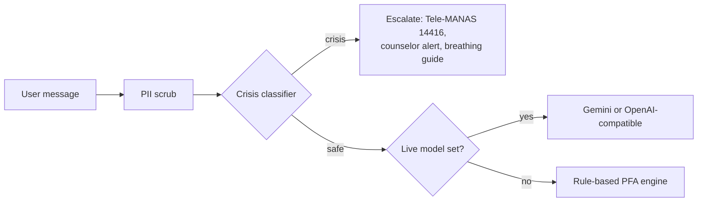

<div align="center">

# SANJEEVANI

**Mental health support and distress monitoring for survivors of atrocities. Private by design, built for people who may be watched.**

[**Live demo**](https://sanjeevanihelp.netlify.app) · Smart India Hackathon 2026 · Team Code Blooded


</div>

<!-- Add screenshots here once you have them (save images in docs/):
<p align="center">
  
  
  
  
</p>
-->

Survivors of caste-based atrocities need counselling, clear visibility into their relief and legal cases, and a way to use a support app without putting themselves at risk. SANJEEVANI puts all three in one platform with three role-based portals: **Survivor**, **Counselor**, and **Nodal Officer**.

> Prototype on synthetic data. Not a clinical tool. In a crisis in India, call **Tele-MANAS 14416** (free, 24×7) or **112**.

## Highlights

- **Safe Harbor companion.** A Psychological First Aid chat. Every message is PII-scrubbed and passes a local crisis classifier *before* anything else happens.
- **Quick Exit.** Press `Esc` twice and the app becomes a working calculator, with sensitive data cleared from browser storage.
- **Counselor console.** Patients ranked by *Distress Velocity* (mood change over 7 days), with telemetry, explainability markers, and SOAP + PHQ-9 notes.
- **Nodal dashboard.** District incidents, response times, counselor load, SLA trends, and the DBT relief funnel.
- **Voice journal.** Speech-to-text plus pitch, energy, and pace analysis, processed on-device.
- **Tamper-evident audit log.** Hash-chained, with a verifier that detects edits.
- **Accessible.** 6 languages (English, Hindi, Marathi, Tamil, Telugu, Bengali), voice navigation, high contrast, text scaling, dark mode.

## Try it in 60 seconds

Open the [live demo](https://sanjeevanihelp.netlify.app) and use the role switcher in the header.

| Do this | You'll see |
| --- | --- |
| Companion → type `I feel hopeless` | Supportive reply and a breathing guide |
| Companion → type `I don't want to live` | Crisis escalation with a Tele-MANAS referral |
| Paste an Aadhaar or phone number in chat | Redacted before processing |
| Press `Esc` twice | Calculator disguise. Long-press `=` for 1.5 s, then enter `2580` to return |
| Bottom-right SOS button | 10-second cancellable countdown |
| Switch to Counselor, click a patient | Telemetry, XAI, SOAP + PHQ-9, audit tabs |

## Run locally

Needs Node.js 18+.

```bash
git clone https://github.com/vabbhhhcoder/Sanjeevani.git
cd Sanjeevani
npm install
npm run dev          # http://localhost:5173
```

`npm run build` type-checks and builds to `dist/`. `npm run preview` serves that build. No API key is needed to run it.

## Optional: live AI

Out of the box the companion uses a rule-based engine. To use a real model, copy `.env.example` to `.env` and set `VITE_AI_API_KEY`, or click the **"Offline engine"** chip in the Survivor portal and paste a key. It supports Gemini and any OpenAI-compatible API (OpenAI, Groq, Ollama).

> `VITE_*` variables are compiled into the public JavaScript bundle. For a public deployment, leave the key empty or route requests through a server-side proxy.

## How the companion works



## Tech stack

React 18 · TypeScript (strict) · Vite 5 · Tailwind CSS · Framer Motion · Recharts · Web Speech API · Web Audio API

<details>
<summary><b>Project structure</b></summary>

```
src/
├── main.tsx, App.tsx
├── lib/          sanitize (PII layer), audit (hash chain), pfa (crisis classifier + companion),
│                 ai (Gemini/OpenAI connector), speech, store (state + RBAC), i18n, types
├── data/         mock.ts (10 seeded survivors, districts, SLA + DBT data)
├── portals/      Survivor, Counselor, Nodal
└── components/   Shell, Consent, Decoy (calculator), AiSettings, ui, ErrorBoundary
```

Deploy configs for Vercel, Netlify, and Render are in the repo root.
</details>

## Limitations

This is a hackathon prototype:
- All data is seeded mock data, with no backend. The prediction and XAI views are illustrative, not from a trained model.
- The default companion is rule-based. A live LLM is optional.
- The audit hash is non-cryptographic (FNV-1a). Production would use SHA-256 with server-side storage.
- The demo PIN (`2580`) is hard-coded. Production would use WebAuthn or a device-bound secret.

**Next:** real backend with auth and encrypted storage, a clinician-validated model, and server-side audit logging.

---

<div align="center">Built for Smart India Hackathon 2026 by <b>Team Code Blooded</b></div>
